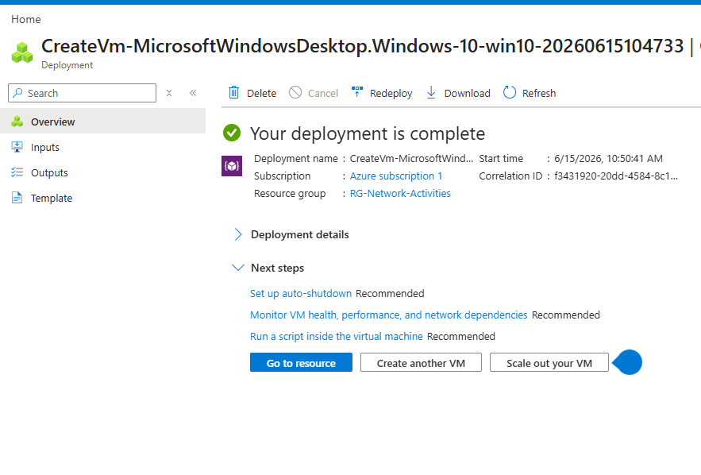
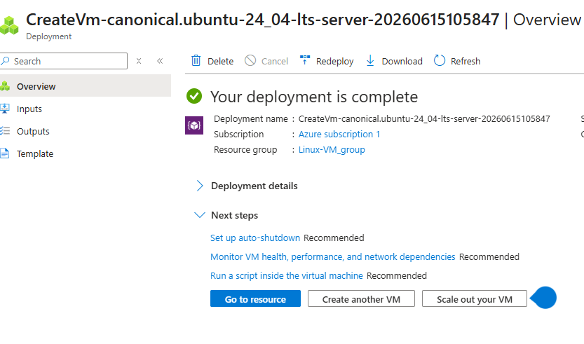
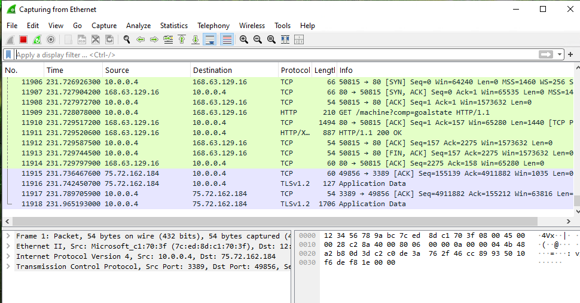
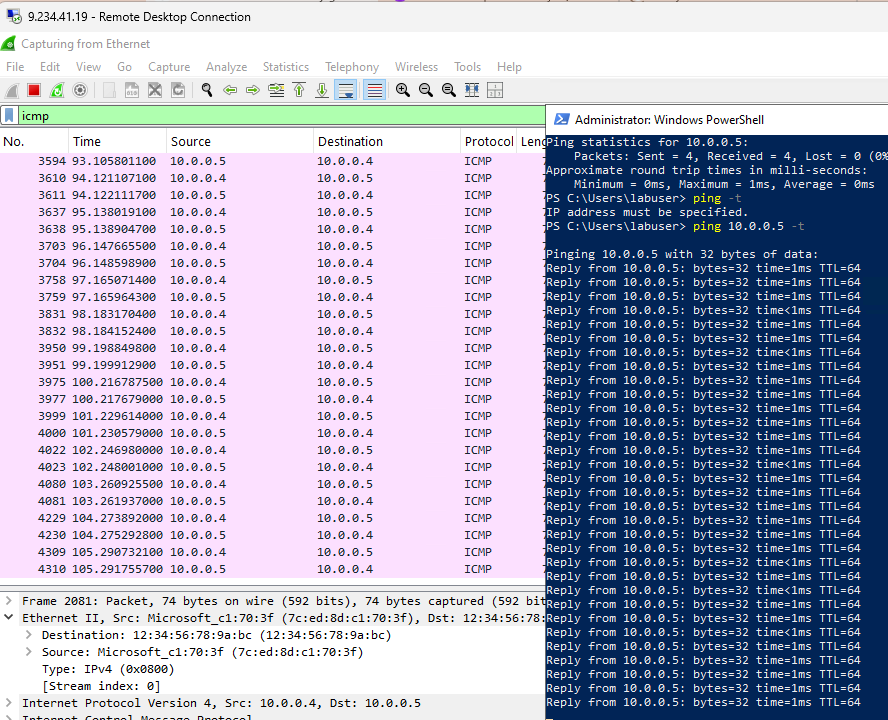
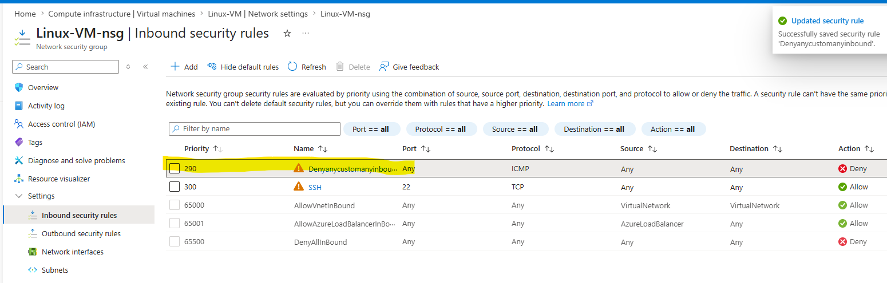
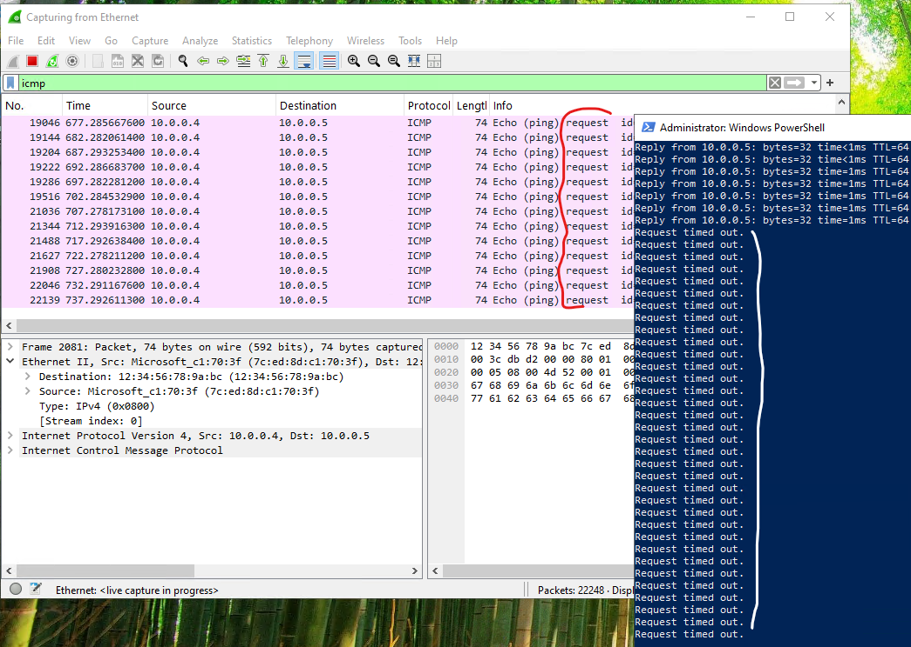
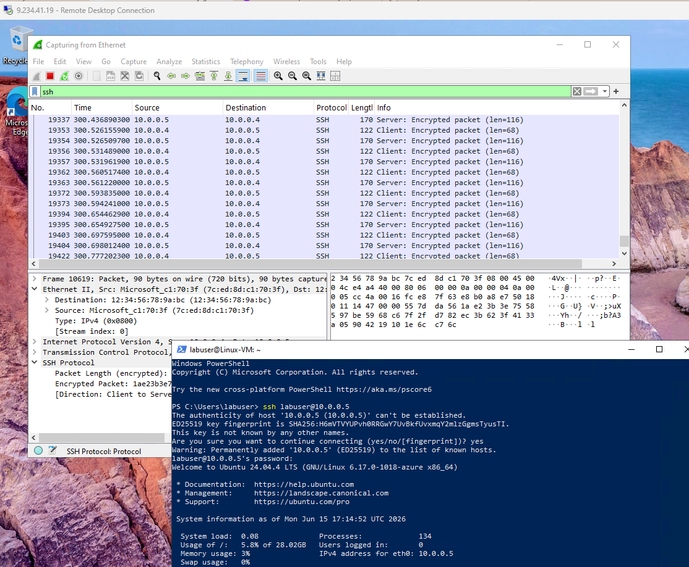
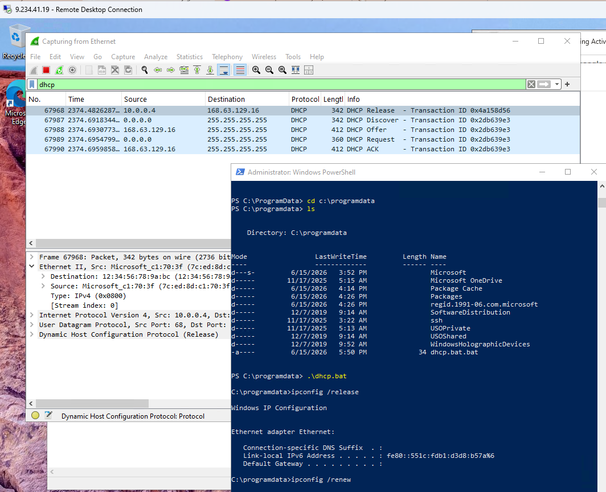
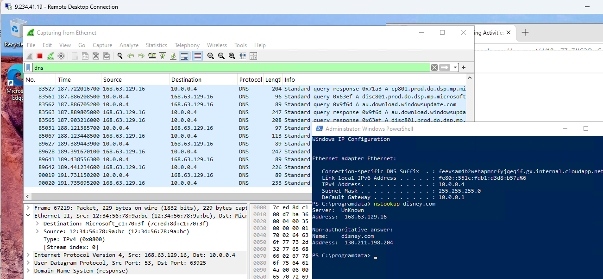
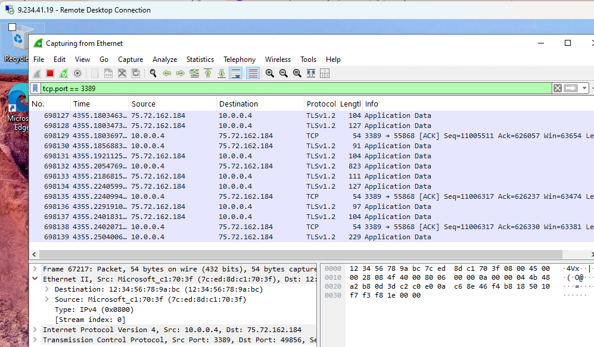

<h1>Network Security Groups (NSGs) and Inspecting Traffic Between Azure Virtual Machines</h1>
In this tutorial, we observe various network traffic to and from Azure Virtual Machines with Wireshark as well as experiment with Network Security Groups.  

<h2>Environments and Technologies Used</h2>

- Microsoft Azure (Virtual Machines/Compute)
- Remote Desktop
- Various Command-Line Tools
- Various Network Protocols (SSH, RDH, DNS, HTTP/S, ICMP)
- Wireshark (Protocol Analyzer)

<h2>Operating Systems Used </h2>

- Windows 10 (21H2)
- Ubuntu Server 20.04

<h2>Project Objectives </h2>

- Deploy and configure Windows and Linux virtual machines in Microsoft Azure.
- Install and utilize Wireshark to capture and analyze network traffic.
- Observe and identify common network protocols including ICMP, SSH, DNS, HTTP, and HTTPS.
- Configure and modify Azure Network Security Group (NSG) rules.
- Test how NSG rules affect communication between Azure virtual machines.
- Develop foundational troubleshooting and network analysis skills using packet inspection tools.

<h2>High-Level Steps</h2>

- Step 1: Create Azure Virtual Machines
Deploy a Windows 10 virtual machine and an Ubuntu Linux virtual machine within the same Azure Virtual Network.

- Step 2: Installed Wireshark and Capture Traffic
Install Wireshark on the Windows VM and begin capturing network packets.

- Step 3: Analyze Network Protocols
Generate and inspect ICMP, SSH, DNS, HTTP, and HTTPS traffic between the virtual machines and external resources.

- Step 4: Configure Network Security Groups
Create and modify NSG inbound security rules to allow or deny specific traffic and observe the impact on connectivity.

<h2>Actions and Observations</h2>

**Action 1: Created Virtual Machines**

- A. Windows

- B. Linux

 

**Action 2: Installed Wireshark and captured ICMP Traffic**

 

Observation

- Wireshark displayed ICMP Echo Requests and Echo Replies.
- This demonstrated successful communication between the two virtual machines and provided visibility into packet-level network activity.

**Action 3: Configured a firewall (Network Security Group)**

- A. Initiated a perpetual / non stop ping from Windows VM

- B. Disabled incoming (inbound) ICMP traffic 

- C. Verifed the ICMP traffic stopped
  

Observation
- Before the NSG rule was applied, the Windows VM received successful ICMP Echo Replies from the Ubuntu VM, confirming network connectivity.
- After inbound ICMP traffic was blocked in the NSG, the ping requests began timing out. Wireshark continued to capture outgoing ICMP Echo Requests, but no Echo Replies were returned from the Ubuntu VM.
- This demonstrated that Azure Network Security Groups can effectively filter and block network traffic before it reaches the virtual machine.
- The test confirmed how firewall rules impact network communication and highlighted the importance of NSGs in controlling and securing Azure network traffic.
 

**Action 4: Examined SSH Traffic**

Observation

- SSH packets were visible in the capture.
- The session demonstrated how encrypted remote administration traffic appears in network analysis tools.

 

**Action 5: Examined DHCP Traffic**

Observation

- After running a script ipconfig /release & ipconfig /renew, DHCP traffic immediately appeared in Wireshark.
- The packet capture showed the communication process between the client computer and the DHCP server responsible for assigning IP configuration information.
- The Windows VM successfully requested and renewed its network configuration, including IP address, subnet mask, default gateway, and DNS server information.
- This demonstrated how devices automatically obtain and maintain network settings through the DHCP protocol.
- The exercise also showed how Wireshark can be used to monitor and troubleshoot IP address assignment issues in a network environment.

 

**Action 6: Examined DNS Traffic**

Observation

- DNS queries and responses were captured.
- The traffic showed how domain names are translated into IP addresses before communication can occur.

 

**Action 7: Examined RDP Traffic**

Observation

- A continuous stream of RDP packets appeared in Wireshark, even when little or no activity was occurring within the remote session.
- The traffic remained constant because RDP continuously exchanges data between the local computer and the remote machine to maintain the connection, update the display, synchronize keyboard and mouse input, and monitor session status.
- The large volume of packets demonstrated that RDP is an interactive protocol requiring frequent communication between client and server.
- Unlike protocols such as DNS or ICMP, which generate traffic only when specific requests are made, RDP produces ongoing traffic throughout the duration of the remote session.
- This observation highlighted how remote administration tools rely on persistent network communication to provide real-time access to remote systems.

<h2>Final Result</h2>

Successfully deployed and configured Windows and Linux virtual machines in Microsoft Azure and used Wireshark to capture, filter, and analyze real-time network traffic. Observed and interpreted multiple network protocols including ICMP, SSH, DNS, DHCP, and RDP, while also configuring Azure Network Security Groups (NSGs) to control and test network communication. Through hands-on packet analysis and firewall rule management, I gained practical experience in cloud networking, network troubleshooting, protocol analysis, and security administration within an Azure environment.

<h2>Skills Demonstrated</h2>

CLOUD COMPUTING AND VIRTUALIZATION
  
- Microsoft Azure Virtual Machine deployment and management
- Azure Virtual Network (VNet) configuration
- Windows and Linux virtual machine administration
- Remote Desktop (RDP) connectivity and management
  
NETWORK ADMINISTRATION

- IP addressing and network connectivity testing
- DHCP lease renewal and IP configuration troubleshooting
- DNS query and name resolution analysis
- ICMP connectivity testing using Ping
- SSH remote connectivity and protocol analysis
  
NETWORK SECURITY

- Azure Network Security Group (NSG) configuration
- Firewall rule creation and modification
- Traffic filtering and access control
- Network security monitoring and validation
- Understanding inbound and outbound traffic rules
  
PACKET ANALYSIS AND TROUBLESHOOTING

- Wireshark installation and configuration
- Packet capture and protocol filtering
- Traffic analysis using protocol-specific filters
- Identification of ICMP, DHCP, DNS, HTTP, HTTPS, SSH, and RDP traffic
- Network troubleshooting using packet-level analysis
- Verification of network communication and security controls
  
PROFESSIONAL IT SKILLS

- Cloud infrastructure administration
- Network monitoring and diagnostics
- Technical documentation
- Security-focused troubleshooting
- Root cause analysis
Hands-on experience with enterprise networking concepts
